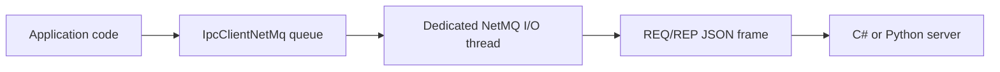

# IpcNetMq

<p align="center">
  
</p>

IpcNetMq is a small request/reply interprocess communication library for .NET, built on [NetMQ](https://github.com/zeromq/netmq). It provides a structured JSON packet protocol, synchronous and asynchronous .NET client APIs, blocking and non-blocking .NET server modes, and a compatible Python server example using [pyzmq](https://pyzmq.readthedocs.io/).

The library is intended for applications that need a clean process boundary between .NET and another process or language—for example, scientific simulations, neural-network inference, hardware interfaces, and independently restartable services—without embedding Python or another runtime inside the .NET process.

## Key Features

- NetMQ/ZeroMQ `REQ`/`REP` transport over configurable endpoints such as `tcp://127.0.0.1:5555`.
- Targets .NET Framework 4.8, .NET 8, and .NET 10.
- One-frame UTF-8 JSON wire format based on `IpcPacket`.
- Automatic request/reply sequence numbering and validation.
- Synchronous and asynchronous .NET client calls.
- Dedicated client I/O thread so a NetMQ socket remains owned by one thread.
- Automatic client reconnection after send or receive failures.
- Blocking server loop for console and service applications.
- Non-blocking polling server API for game loops and simulation update loops.
- Canonical name/value payload helpers with tolerant JSON deserialization.
- C# client, C# server, and interoperable Python server examples.
- Out-of-process isolation: independent runtimes, dependencies, memory, failure handling, and restart behavior.

## Requirements

### .NET

- .NET 10 SDK for the supplied C# examples.
- .NET 8 SDK for the test project.
- Visual Studio 2026 or the `dotnet` command-line tools.
- NetMQ 4.0.4.3.
- System.Text.Json 10.0.11.

The library itself targets:

```text
net48
net8.0
net10.0
```

### Python example

- Python 3.11 or later recommended.
- pyzmq.

Install the Python dependency with:

```powershell
py -3.11 -m pip install pyzmq
```

## Quick Start

### 1. Build the solution

```powershell
dotnet build IpcNetMq.sln -c Release
```

### 2. Start the C# server

```powershell
dotnet run --project .\Examples\TestServerCSharp\TestServerIpc.csproj -- tcp://127.0.0.1:5555
```

### 3. Start the C# client in another terminal

```powershell
dotnet run --project .\Examples\TestClientCSharp\TestClientIpc.csproj -- tcp://127.0.0.1:5555
```

The client repeatedly sends an `IpcPacket`, waits for the matching reply, validates the sequence number, and periodically reports average round-trip time.

## Basic Client Usage

Create one `IpcClientNetMq` for each logical client connection. The current client API queues calls onto a dedicated I/O thread; do not call `OpenConnection()` when using `CallIpcMethod()` or `CallIpcMethodAsync()` because the dispatcher opens and reconnects the socket as needed.

```csharp
using IpcNetMq;
using IpcNetMq.IpcNetMqHelpers;

const string address = "tcp://127.0.0.1:5555";

using var client = new IpcClientNetMq("SimulationClient", address);

var request = new IpcPacket
{
    Action = "do_get1",
    ContextString = JsonHelpers.BuildNameValuePairs(
        ("SimTime", "12.5")),
    RequestString = JsonHelpers.BuildNameValuePairs(
        ("exprOne", "10"),
        ("exprTwo", "23.4")),
    ReplyString = JsonHelpers.BuildNameValuePairs(
        ("stateOne", ""),
        ("stateTwo", ""))
};

IpcPacket reply = await client.CallIpcMethodAsync(
    request,
    sendTimeout: TimeSpan.FromSeconds(2),
    receiveTimeout: TimeSpan.FromSeconds(5));

Console.WriteLine($"{reply.Action}: {reply.ReplyString}");
```

The client assigns `SequenceNumber`. Application code should not attempt to assign or modify it.

For callers that cannot use `async`, the equivalent blocking call is:

```csharp
IpcPacket reply = client.CallIpcMethod(
    request,
    sendTimeout: TimeSpan.FromSeconds(2),
    receiveTimeout: TimeSpan.FromSeconds(5));
```

## Basic Server Usage

### Blocking server loop

The blocking server loop is appropriate for a console program, background service, or dedicated server thread:

```csharp
using IpcNetMq;

const string address = "tcp://127.0.0.1:5555";

using var server = new IpcServerNetMq("SimulationServer", address);
server.RunIpcServerLoop(HandleAction);

static IpcPacket HandleAction(IpcPacket request)
{
    return request.Action switch
    {
        "Ping" => new IpcPacket
        {
            Action = "SUCCESS",
            Status = "Success",
            ReplyString = "Pong"
        },

        _ => new IpcPacket
        {
            Action = "FAIL",
            Status = $"Unknown action: {request.Action}"
        }
    };
}
```

`RunIpcServerLoop()` receives requests and invokes the handler serially. The server assigns the reply sequence number and copies the request's `ClientId` into the reply.

### Non-blocking polling server

Polling mode is intended for hosts that own their main loop, such as Stride, another game engine, or a discrete-event simulation:

```csharp
private readonly IpcServerNetMq server =
    new("SimulationServer", "tcp://127.0.0.1:5555");

public void Start()
{
    server.EnsurePollingReady();
}

public void Update()
{
    if (!server.TryGetRequest(out IpcPacket request))
        return;

    IpcPacket reply = HandleAction(request);
    server.SendReply(reply);
}
```

`TryGetRequest()` never blocks. After it returns `true`, `SendReply()` must be called exactly once before the server can receive another request. This is required by the ZeroMQ `REP` socket state machine.

For a frame-based host that wants to limit IPC work per update, poll up to a configured maximum:

```csharp
for (int i = 0; i < maxRequestsPerFrame; i++)
{
    if (!server.TryGetRequest(out IpcPacket request))
        break;

    server.SendReply(HandleAction(request));
}
```

With a `REP` socket, there can only be one received-but-not-yet-replied request at a time, so each successful poll must still be paired immediately with its reply.

## Architecture



### Client

`IpcClientNetMq` owns a NetMQ `RequestSocket` and a bounded work queue. Calls to `CallIpcMethodAsync()` enqueue work; a single background I/O thread performs the following operations:

1. Create or reconnect the socket.
2. Assign the next odd request sequence number.
3. Serialize the request to JSON.
4. Send one ZeroMQ frame.
5. Receive one reply frame.
6. Deserialize the reply.
7. Verify that its sequence number is the request number plus one.
8. Complete the caller's task.

The single I/O thread is intentional. NetMQ sockets are thread-affine and must not be used concurrently from arbitrary application threads.

The work queue is currently bounded to 1,024 calls. REQ/REP permits only one request in flight on a socket, so queued requests are processed serially.

### Server

`IpcServerNetMq` derives from `IpcServerBaseNetMq`, which owns the NetMQ `ResponseSocket`, endpoint binding, shutdown, retry, and disposal behavior.

The concrete server exposes two hosting models:

- `RunIpcServerLoop(...)`: blocking, serial request processing.
- `EnsurePollingReady()` + `TryGetRequest(...)` + `SendReply(...)`: non-blocking integration into an externally controlled loop.

Do not mix blocking-loop mode and polling mode on the same server instance.

### Wire protocol

Each transaction uses one UTF-8 JSON frame in each direction. No manual byte count, delimiter, or length prefix is added; ZeroMQ preserves frame boundaries.

The outer object is `IpcPacket`:

| JSON property | C# property | Purpose |
| --- | --- | --- |
| `version` | `Version` | Packet schema version; currently `V260107`. |
| `client_id` | `ClientId` | Logical client identifier. |
| `sequence_number` | `SequenceNumber` | Odd request number or following even reply number. |
| `world_time` | `WorldTime` | UTC packet construction time. |
| `action` | `Action` | Operation or method name. |
| `status` | `Status` | Result status or diagnostic text. |
| `options_string` | `OptionsString` | JSON text for IPC options or transaction metadata. |
| `context_string` | `ContextString` | JSON text for persistent or call-specific context. |
| `request_string` | `RequestString` | JSON text containing request arguments. |
| `reply_string` | `ReplyString` | JSON text containing the reply or a reply template. |

The four `*_string` fields are strings in the outer JSON packet. When they contain structured data, that inner data is serialized as JSON text and is therefore escaped once by the outer packet serializer.

Example outer packet:

```json
{
  "version": "V260107",
  "client_id": "SimulationClient",
  "sequence_number": 1,
  "world_time": "2026-08-19T18:00:00.0000000Z",
  "action": "do_get1",
  "status": "",
  "options_string": "",
  "context_string": "{\"SimTime\":\"12.5\"}",
  "request_string": "{\"exprOne\":\"10\"}",
  "reply_string": "{\"stateOne\":\"\"}"
}
```

### Sequence-number contract

Sequence numbers are transport metadata owned by IpcNetMq:

| Message | Sequence |
| --- | ---: |
| First request | 1 |
| First reply | 2 |
| Second request | 3 |
| Second reply | 4 |

- The .NET client assigns odd request numbers.
- The server assigns `request.SequenceNumber + 1` to the reply.
- The client rejects a reply whose sequence number does not match the expected even number.
- Application handlers should construct reply content but should not set `SequenceNumber`.

The Python server follows the same contract explicitly.

### Name/value payloads

The canonical inner payload is a JSON array of lowercase `name`/`value` objects:

```json
[
  { "name": "exprOne", "value": "10" },
  { "name": "exprTwo", "value": "23.4" }
]
```

Create and read these payloads with:

```csharp
var values = new List<NameValuePair>
{
    new("exprOne", "10"),
    new("exprTwo", "23.4")
};

string json = NameValuePairJson.SerializeList(values);

List<NameValuePair> decoded =
    NameValuePairJson.DeserializeListTolerant<NameValuePair>(json);
```

The tolerant deserializer accepts an array, one object, empty input, or legacy double-encoded JSON. New code should emit the canonical single-encoded array form.

`JsonHelpers.BuildNameValuePairs(...)` remains available for the legacy dictionary representation used by the current examples.

## Python Server Example

The Python example demonstrates that the protocol is language-neutral. A .NET `RequestSocket` can communicate directly with a Python pyzmq `REP` socket because both use the same ZeroMQ framing and JSON schema.

The example is located in:

```text
Examples/ServerPython/
├── IpcPacket.py
├── ServerZeroMQ.py
└── UserActions.py
```

### Run the Python server

From the repository root:

```powershell
cd .\Examples\ServerPython
py -3.11 -m pip install pyzmq
py -3.11 .\ServerZeroMQ.py tcp://127.0.0.1:5555
```

If no endpoint is supplied, the script prompts for one and defaults to `tcp://127.0.0.1:5555`.

### Run the C# client against Python

In a second terminal, from the repository root:

```powershell
dotnet run --project .\Examples\TestClientCSharp\TestClientIpc.csproj -- tcp://127.0.0.1:5555
```

The client sends `do_get1` requests. `ServerZeroMQ.py` deserializes the packet, dispatches the action to `UserActions.py`, increments the sequence number for the reply, serializes the result, and returns one UTF-8 JSON frame.

### Add a Python action

Define a handler in `UserActions.py`:

```python
def handle_ping(in_packet):
    out_packet = in_packet.clone()
    out_packet.sequence_number = in_packet.sequence_number + 1
    out_packet.action = "SUCCESS"
    out_packet.status = "Success"
    out_packet.reply_string = "Pong"
    return out_packet
```

Then register it in `ServerZeroMQ.py`:

```python
action_handlers = {
    "Ping": handle_ping,
    "do_get1": handle_do_get1,
    "do_get2": do_get2,
}
```

Every Python `REP` request must receive exactly one reply, including invalid actions and error cases. Otherwise the socket cannot receive the next request.

## Failure and Recovery Behavior

### Client behavior

- Default send timeout: 2 seconds.
- Default receive timeout: 5 seconds.
- A failed send triggers one reconnect and one retry.
- A request that was sent but did not receive a valid reply causes the REQ socket to be recreated before subsequent work.
- A sequence mismatch completes the call with an exception.
- Cancellation completes the associated task as canceled.
- Calls are queued and processed serially.

Timeouts may occur normally while debugging a server. The caller should catch `TimeoutException`, apply an appropriate backoff, and retry at the application level when the operation is safe to repeat.

### Server behavior

- Requests are processed serially.
- The blocking loop closes and rebuilds its socket after processing or socket failures.
- Socket-open failures use a capped linear retry delay of up to five seconds.
- The loop exits after ten consecutive failed attempts to open the socket.
- Polling mode is non-blocking but requires exactly one reply for every request received.
- Disposal closes/unbinds the socket and invokes NetMQ cleanup on a best-effort basis.

### Delivery semantics

IpcNetMq provides request/reply correlation; it does not provide durable messaging or exactly-once execution.

If a server completes an operation but its reply is lost, the client can observe only a timeout. Retrying a state-changing action may execute it again. Such operations should carry an application-level operation ID or implement idempotency when duplicate execution would be unsafe.

## Benchmarks

An observed localhost interoperability test using the supplied .NET client and Python pyzmq server measured approximately:

| Path | Transport | Payload | Average round trip |
| --- | --- | --- | ---: |
| C# client → Python server → C# client | Loopback TCP, NetMQ/pyzmq, JSON | Small `IpcPacket` request/reply | **210 μs** |

That latency corresponds to a theoretical maximum of approximately 4,760 sequential round trips per second before application work (and yes, it is 210 microseconds, not milliseconds). It is not a measured sustained-throughput result, and this is on the same machine (IP loopback).

The figure is an informal development measurement, not a controlled cross-platform benchmark. Results depend on processor, operating system, power state, Python and .NET versions, payload size, logging, debugger attachment, endpoint type, and server handler work.

For simulation and neural-network calls that take milliseconds or longer, the measured IPC cost is generally small relative to the invoked work. The process boundary also provides benefits that in-process Python integration does not: runtime isolation, independent dependency environments, failure containment, restartability, easier diagnostics, and the option to move the service to another machine later.

When publishing benchmark results, record at least:

- CPU and operating system.
- .NET and Python versions.
- NetMQ and pyzmq versions.
- Release versus Debug build.
- Transport endpoint.
- Payload size.
- Warm-up count and measured iteration count.
- Median, mean, p95, p99, minimum, and maximum latency.
- Whether logging and a debugger were enabled.

## Directory Layout

```text
IpcNetMq/
├── IpcNetMq.csproj                 Main multi-target library project
├── IpcNetMq.sln                    Visual Studio solution
├── IpcPacket.cs                    Wire packet and sequence metadata
├── IpcClientNetMq.cs               REQ client, queue, I/O thread, reconnect logic
├── IpcServerNetMq.cs               REP server: blocking and polling APIs
├── IIpcClient.cs                   Legacy/general client interface
├── IIpcServer.cs                   Legacy/general server interface
├── IpcNetMqHelpers/
│   ├── IpcServerBase.cs            Socket binding, retry loop, disposal
│   ├── JsonHelpers.cs              Packet and payload serialization
│   ├── NameValuePair.cs            Canonical name/value DTO and JSON options
│   ├── NameValuePairSerialization.cs
│   │                                Tolerant name/value serialization
│   ├── CommunicationHelpers.cs     Endpoint hashing helper
│   ├── Extensions.cs               Conversion and string helpers
│   └── Logger.cs                   Example asynchronous file logger
├── Examples/
│   ├── TestClientCSharp/           .NET 10 client and timing example
│   ├── TestServerCSharp/           .NET 10 blocking/polling server example
│   └── ServerPython/               Python/pyzmq interoperable server
├── IpcNetMq.Tests/                 .NET 8 xUnit serialization tests
├── Documentation/                  Additional project documentation
├── Resources/                      Package icon assets
└── LICENSE.txt                     Repository license text
```

`IpcServerNetMqBeta.cs` is experimental code and is not part of the documented primary API.

## Build, Test, and Package

### Build

```powershell
dotnet build IpcNetMq.sln -c Release
```

To build one target explicitly:

```powershell
dotnet build IpcNetMq.csproj -c Release -f net10.0
```

### Test

```powershell
dotnet test .\IpcNetMq.Tests\IpcNetMq.Tests.csproj -c Release
```

The current automated tests focus on packet and name/value JSON serialization. End-to-end transport and concurrency tests should be added as the protocol evolves.

### Package

The main project is configured to generate a NuGet package on build. It can also be packed explicitly:

```powershell
dotnet pack IpcNetMq.csproj -c Release
```

Package outputs are written beneath `bin\Release`.

## Troubleshooting

### `Address already in use`

Only one server can bind a particular endpoint. Stop the existing server or select another port, such as `tcp://127.0.0.1:5556`.

### Client receive timeout

Confirm that:

- The server is running and bound to the same address.
- The server sends exactly one reply for every request.
- The action name is registered by the server.
- The server handler did not throw before sending its reply.
- A debugger pause did not exceed the receive timeout.

The .NET client recreates its REQ socket after an incomplete request/reply exchange.

### Sequence mismatch

Do not set `IpcPacket.SequenceNumber` in application handlers. The client owns request numbering; the .NET server assigns the next even reply number. A non-.NET server must return `request.sequence_number + 1`.

### NetMQ socket thread error

Do not access the underlying socket from another thread. Use `CallIpcMethod()` or `CallIpcMethodAsync()` so the client dispatcher retains socket ownership.

### Python `IndentationError`

Python indentation is syntax. Use four spaces consistently, avoid mixing tabs and spaces, and compile-check all three example files:

```powershell
py -3.11 -m py_compile .\IpcPacket.py .\ServerZeroMQ.py .\UserActions.py
```

### Python cannot import `zmq`

Install pyzmq into the same Python interpreter used to start the server:

```powershell
py -3.11 -m pip install pyzmq
py -3.11 -c "import zmq; print(zmq.zmq_version())"
```

### Python edits appear to have no effect

Confirm that the file being edited is the same file shown in the traceback. In particular, `IpcPacket.py` and a copied file such as `IpcPacket(1).py` are different modules.

## Design Scope and Limitations

- The primary transport pattern is synchronous REQ/REP.
- One client socket has at most one request in flight.
- Server handlers run serially.
- The transport is not a durable queue.
- Authentication, encryption, authorization, schema negotiation, and service discovery are outside the current library.
- TCP endpoints exposed beyond loopback require application-specific network security.
- Large binary payloads are not optimized; the current protocol is JSON-oriented.
- Higher concurrency may eventually require multiple clients/workers or a different ZeroMQ pattern such as ROUTER/DEALER.

## Contributing

Issues and pull requests should include:

- A clear description of the behavior or protocol change.
- Tests covering packet compatibility and sequence handling.
- Updates to both C# and Python examples when the wire contract changes.
- Benchmark conditions when making performance claims.
- No application-level assignment of `SequenceNumber`.

Keep wire-format changes backward compatible when possible. If compatibility cannot be maintained, update `IpcPacket.Version` and document the schema change.

## License

See [`LICENSE.txt`](LICENSE.txt) for the repository's license terms. Package metadata and the repository license file should declare the same license before release.
